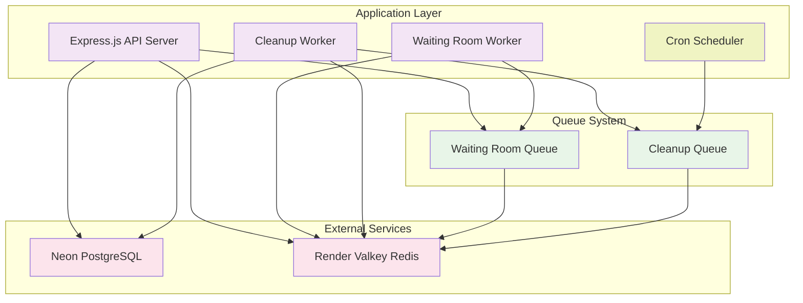

# Evently Backend - High-Level Architecture Diagram

## Architecture Components

### 1. **Application Layer**
- **Express.js API Server**: Main REST API handling all HTTP requests including direct booking processing
- **Waiting Room Worker**: Processes virtual waiting room queue for traffic throttling
- **Cleanup Worker**: Background job processor for cleaning up expired bookings and seat locks
- **Cron Scheduler**: Schedules cleanup jobs every 2 minutes using node-cron

### 2. **Queue System**
- **Waiting Room Queue**: Handles virtual waiting room traffic throttling (BullMQ)
- **Cleanup Queue**: Processes expired booking cleanup jobs (BullMQ)
- Both queues use Redis for persistent storage

### 3. **External Services**
- **Neon PostgreSQL**: Managed PostgreSQL database service for primary data storage
- **Render Valkey**: Managed Redis-compatible service for caching, queues, and seat locking

## Key Design Decisions

### **Concurrency Handling**
- **Direct Booking Processing**: Bookings are processed synchronously in the API for immediate response
- **Dual-Layer Locking**: PostgreSQL `FOR UPDATE` locks + Redis distributed locks for seat reservation
- **Atomic Transactions**: All booking operations are wrapped in database transactions

### **Queue Usage Strategy**
- **Waiting Room Only**: Queues are used exclusively for virtual waiting room traffic throttling
- **No Booking Queue**: Booking operations are processed directly for better user experience
- **Cleanup Automation**: Background cleanup of expired locks via scheduled jobs

### **Lock Management**
- **Redis Seat Locks**: Distributed locks with 10-minute expiration for seat reservations
- **Database Row Locks**: `FOR UPDATE` prevents race conditions during seat availability checks
- **Automated Cleanup**: Cron job runs every 2 minutes to clean up expired bookings and locks

### **Scalability Features**
- **Connection Pooling**: PostgreSQL connection pooling for efficient resource usage
- **Redis for State**: All temporary state (locks, waiting room) stored in Redis
- **Stateless API**: API server design allows horizontal scaling

### **Fault Tolerance**
- **Graceful Degradation**: System handles Redis or database failures gracefully
- **Lock Expiration**: Automatic lock cleanup prevents deadlocks
- **Transaction Rollback**: Database transactions ensure data consistency on failures
