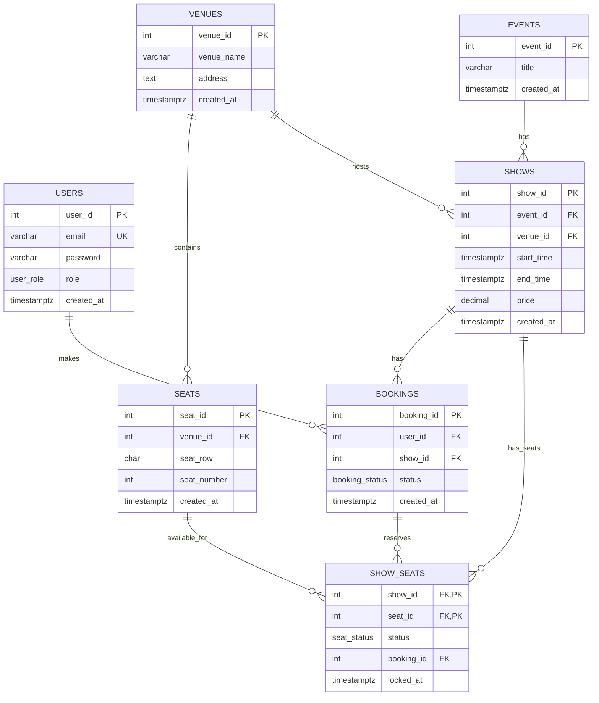

# Evently Backend - Entity-Relationship (ER) Diagram

## Entity Descriptions

### **USERS Table**
- **Purpose**: Stores user account information and authentication data
- **Key Fields**:
  - `user_id`: Primary key, auto-incrementing
  - `email`: Unique email address for login
  - `password`: User password (hashed before storage)
  - `role`: User role enum ('user' or 'admin')
  - `created_at`: Account creation timestamp

### **VENUES Table**
- **Purpose**: Stores venue information where events are held
- **Key Fields**:
  - `venue_id`: Primary key, auto-incrementing
  - `venue_name`: Name of the venue
  - `address`: Physical address of the venue
  - `created_at`: Venue creation timestamp

### **SEATS Table**
- **Purpose**: Stores individual seat information for each venue
- **Key Fields**:
  - `seat_id`: Primary key, auto-incrementing
  - `venue_id`: Foreign key to VENUES table
  - `seat_row`: Seat row identifier (e.g., 'A', 'B')
  - `seat_number`: Seat number within the row
  - `created_at`: Seat creation timestamp
- **Constraints**:
  - Unique constraint on (venue_id, seat_row, seat_number)
  - Foreign key constraint with CASCADE DELETE

### **EVENTS Table**
- **Purpose**: Stores high-level event information
- **Key Fields**:
  - `event_id`: Primary key, auto-incrementing
  - `title`: Event title/name
  - `created_at`: Event creation timestamp

### **SHOWS Table**
- **Purpose**: Stores specific show instances of events (event + venue + time)
- **Key Fields**:
  - `show_id`: Primary key, auto-incrementing
  - `event_id`: Foreign key to EVENTS table
  - `venue_id`: Foreign key to VENUES table
  - `start_time`: Show start time
  - `end_time`: Show end time
  - `price`: Ticket price for the show
  - `created_at`: Show creation timestamp
- **Constraints**:
  - Foreign key constraints with CASCADE DELETE

### **BOOKINGS Table**
- **Purpose**: Links users to show bookings
- **Key Fields**:
  - `booking_id`: Primary key, auto-incrementing
  - `user_id`: Foreign key to USERS table
  - `show_id`: Foreign key to SHOWS table
  - `status`: Booking status enum ('PENDING', 'CONFIRMED', 'CANCELLED')
  - `created_at`: Booking creation timestamp
- **Constraints**:
  - Foreign key constraints with CASCADE DELETE

### **SHOW_SEATS Table**
- **Purpose**: Junction table managing seat availability and bookings for specific shows
- **Key Fields**:
  - `show_id`: Foreign key to SHOWS table (part of composite primary key)
  - `seat_id`: Foreign key to SEATS table (part of composite primary key)
  - `status`: Seat status enum ('AVAILABLE', 'LOCKED', 'BOOKED')
  - `booking_id`: Foreign key to BOOKINGS table (nullable)
  - `locked_at`: Timestamp when seat was locked for booking
- **Constraints**:
  - Composite primary key on (show_id, seat_id)
  - Foreign key constraints with CASCADE DELETE (SET NULL for booking_id)

## Relationships

### **One-to-Many Relationships**
1. **VENUES → SEATS**: One venue contains multiple seats
2. **USERS → BOOKINGS**: One user can have multiple bookings
3. **SHOWS → BOOKINGS**: One show can have multiple bookings
4. **EVENTS → SHOWS**: One event can have multiple shows (different venues/times)
5. **VENUES → SHOWS**: One venue can host multiple shows

### **Many-to-Many Relationships**
1. **SEATS ↔ SHOWS**: Many seats can be available for many shows (via SHOW_SEATS)
2. **BOOKINGS ↔ SHOW_SEATS**: One booking can reserve multiple seats, managed through SHOW_SEATS

## Database Constraints

### **Primary Keys**
- Most tables have auto-incrementing integer primary keys
- `SHOW_SEATS` uses composite primary key (show_id, seat_id)

### **Foreign Keys**
- All foreign key relationships use CASCADE DELETE
- `SHOW_SEATS.booking_id` uses SET NULL on delete
- Ensures data integrity when parent records are deleted

### **Unique Constraints**
- `USERS.email`: Ensures unique email addresses
- `SEATS(venue_id, seat_row, seat_number)`: Prevents duplicate seats in venues

### **ENUM Types**
- `user_role`: 'user' or 'admin'
- `booking_status`: 'PENDING', 'CONFIRMED', 'CANCELLED'
- `seat_status`: 'AVAILABLE', 'LOCKED', 'BOOKED'

### **Indexes**
- `idx_show_seats_show_id`: Optimizes show-based seat queries
- `idx_show_seats_seat_id`: Optimizes seat-based queries
- `idx_show_seats_status`: Optimizes seat status queries
- `idx_show_seats_booking_id`: Optimizes booking-based seat queries
- `idx_bookings_user_id`: Optimizes user-based booking queries
- `idx_bookings_show_id`: Optimizes show-based booking queries
- `idx_bookings_status`: Optimizes booking status queries
- `idx_seats_venue_id`: Optimizes venue-based seat queries
- `idx_shows_event_id`: Optimizes event-based show queries
- `idx_shows_venue_id`: Optimizes venue-based show queries
- `idx_shows_start_time`: Optimizes time-based show queries

## Data Integrity Features

### **Referential Integrity**
- Foreign key constraints ensure all references are valid
- CASCADE DELETE maintains consistency when parent records are removed
- SET NULL for booking_id in SHOW_SEATS preserves seat history

### **Business Logic Constraints**
- ENUM types enforce valid status values
- Unique constraints prevent duplicate seats and email addresses
- Composite primary key in SHOW_SEATS ensures one record per seat per show

### **Seat Management Features**
- Seat locking mechanism prevents double booking
- Status tracking for seats (AVAILABLE, LOCKED, BOOKED)
- Temporal locking with `locked_at` timestamp

### **Performance Optimizations**
- Strategic indexes on frequently queried columns
- Composite primary keys for efficient junction table operations
- Optimized for seat selection and booking workflows
- Efficient venue and show-based queries
